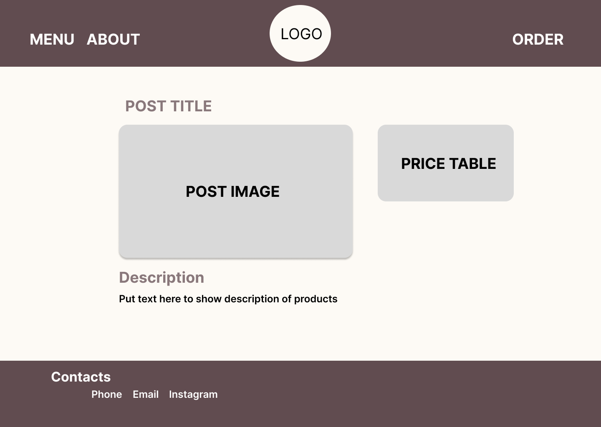

# ☕ CoffeeShop

Projeto desenvolvido como **trabalho de entrega final** 🎓 do curso de **especialização em front-end**. A ideia é simular a presença digital de uma cafeteria que oferece **cafés especiais**, com foco em experiência do usuário, organização do conteúdo e, nas próximas etapas, interatividade mais rica com **JavaScript** ⚡ e **React** ⚛️.

## 📌 Sobre o projeto

Trata-se de um site para a marca fictícia **CoffeeShop**, onde o visitante pode:

- 📋 **Ver o cardápio** — bebidas (café, cappuccino, matcha etc.) com tamanhos e preços.
- 🏢 **Conhecer a empresa** — seção **Sobre** com história, valores e diferenciais (em desenvolvimento 🚧).
- 🛒 **Fazer pedidos** — fluxo para compra de produtos com opções de **retirada na loja (pickup)** 🏪 e **entrega (delivery)** 🛵 (em desenvolvimento 🚧).

## 📐 Wireframe de média fidelidade — cardápio

No projeto CoffeeShop, o wireframe abaixo representa o plano da **página do menu/cardápio**: barra superior com links **MENU**, **ABOUT** e **ORDER**, logo central, área de produto com imagem, **tabela de preços** ao lado, bloco de **descrição** e rodapé **Contacts** (telefone, e-mail, Instagram), em paleta marrom/cream alinhada ao tema cafeteria.



O objetivo acadêmico é demonstrar competências em **HTML**, **CSS**, estrutura de páginas, acessibilidade básica ♿, layout responsivo 📱 e, em breve, **componentização e estado** com React, além de lógica de interface com JavaScript.

## 🛠️ Estado atual da stack

| Tecnologia   | Situação   |
| ------------ | ---------- |
| HTML5        | ✅ Em uso  |
| CSS3         | ✅ Em uso  |
| JavaScript   | 🔜 Planejado |
| React        | 🔜 Planejado |

Hoje o repositório contém principalmente marcação estática e estilos. As áreas **Sobre** e **Pedido** estão previstas na navegação e serão implementadas nas próximas iterações.

## 💻 Como visualizar localmente

1. 📥 Clone ou baixe o repositório.
2. 🌐 Abra o arquivo `index.html` no navegador **ou** sirva a pasta do projeto com um servidor estático (recomendado para evitar problemas com caminhos de arquivos).

Exemplo com Python (na pasta do projeto):

```bash
python -m http.server 8080
```

Depois acesse `http://localhost:8080` no navegador.

## 📁 Estrutura do repositório (resumo)

```
coffee_shop/
├── index.html          # Página principal (cardápio)
├── assets/
│   ├── css/            # Estilos
│   └── img/            # Imagens e identidade visual
├── wireframes/
│   └── menu-mid fidelity.png   # Wireframe média fidelidade (menu)
└── README.md
```

## 🚀 Próximos passos sugeridos

- 📄 Páginas ou rotas para **Sobre** e **Pedido** (pickup / delivery).
- ⚡ Integração com **JavaScript** para carrinho, formulários e validação.
- ⚛️ Migração ou reconstrução com **React** (componentes reutilizáveis, estado do pedido).
- ♿ Melhorias de **acessibilidade** e **responsividade** conforme critérios do curso.

---

**👤 Autor:** Pedro Henrique Trindade — 2026.
